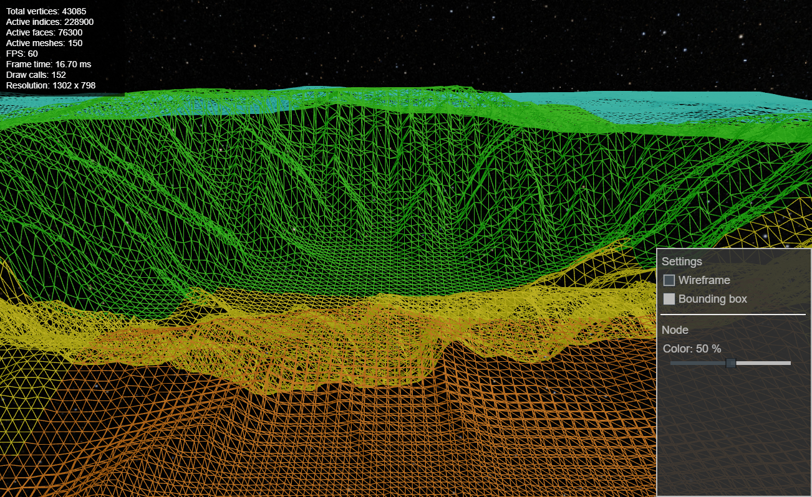

# CDLOD Terrain with Babylon.js Demo

This project demonstrates a Continuous Distance-Dependent Level-Of-Detail (CDLOD) system for procedural terrain on a flat plane using Babylon.js. The system dynamically subdivides the terrain based on the camera's distance, ensuring smooth LOD transitions while avoiding visual seams.

## Features

- **CDLOD Terrain System:** Dynamically generates terrain chunks based on camera distance using a quadtree.
- **Vertex Geomorphing:** Smooth LOD transitions and vertex morphing using custom GLSL shaders.
- **Debug Options:** Wireframe mode and bounding box visualization for easier debugging.
- **Keyboard Navigation:** Use the arrow keys to move around the terrain.

## Getting Started

### Prerequisites

- [Node.js](https://nodejs.org/)
- [npm](https://www.npmjs.com/)
- [Vite](https://vitejs.dev/)

### Installation

1. **Clone the repository:**

   ```bash
   git clone https://github.com/bpodwinski/TerrainCDLODBabylonJs.git
   ```
